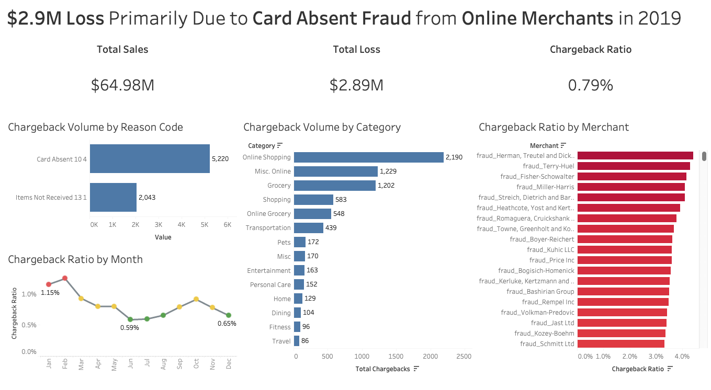

# Merchant Transaction Risk Monitor

### 👉 [View the Full Case Study & Business Insights](https://tomnguyentran.github.io/portfolio/risk_monitor/)

---

### Technical Summary

* **Objective:** Identify root causes of $2.9M in losses and reduce chargeback ratios.
* **Tools Used:** 
  * **SQL:** Aggregate transaction metrics for the dashboard.
  * **Python:** Simulate chargeback scenarios and assign Visa reason codes (10.4 and 13.1).
  * **Tableau:** Dashboard for risk monitoring.
* **Repository Structure:** 
  * `/images`: Screenshots used in the portfolio write up.
  * `/output`: Output file from SQL queries.
  * `/scripts`: Python scripts for chargeback simulation.
  * `/queries`: SQL queries for dashboard.

*For the full storytelling, please visit the link above.*